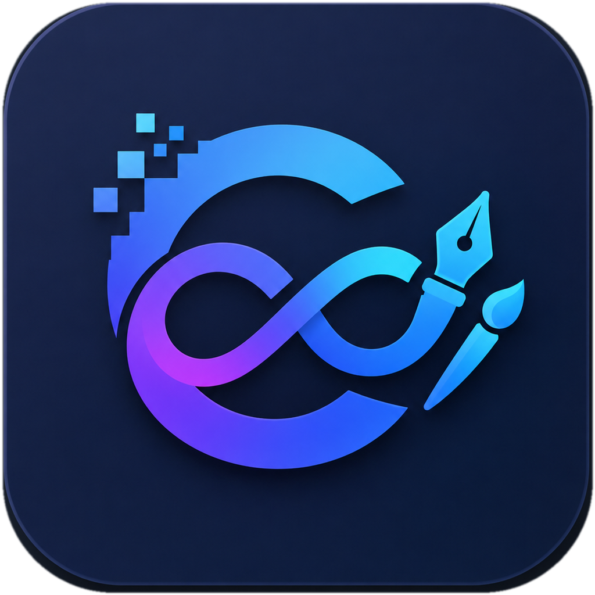
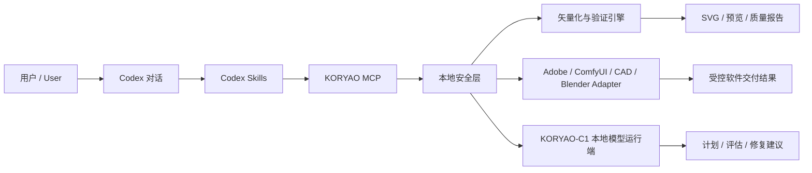

<p align="center">
  
</p>

<h1 align="center">KORYAO Basic｜构曜纪基础版</h1>

<p align="center">
  面向设计师与创意工作者的本地 AI 工作台：把 Codex、图片矢量化、任务验证与创意软件交付连接成一条可追溯流程。
</p>

<p align="center">
  <strong>Local-first · Windows-first · Safe-by-default · Evidence-backed</strong>
</p>

<p align="center">
  <a href="https://github.com/jianbaorui07-dot/KORYAO-basic/actions/workflows/ci.yml"></a>
  
  
  
  
</p>

---

当前发布边界 / Current release boundary: **v0.1-alpha**。核心安全探针和像素重建（精确重建）标记为 `stable`；桌面端、Adobe 写入和本地模型运行端标记为 `experimental`；其余能力按证据标记为 `planned` 或 `not implemented`。

> AutoCAD/DXF plan validate / dry-run / guarded write. Photoshop, Illustrator, Blender, and CapCut write flows are experimental or planned.

## 项目定位

KORYAO Basic 不是“套壳聊天页面”，也不是把图片上传到远程服务器的在线工具。它由三个部分组成：

1. **Codex 调度层**：理解用户目标，选择合适的 Skill 与 MCP 工具。
2. **本地安全运行时**：限制路径、要求确认、执行任务、验证结果并生成脱敏记录。
3. **创意生产工具链**：完成图片矢量化、Adobe 文件交付、ComfyUI/CAD/Blender 等桥接任务。

核心目标是让创意任务形成一条清楚的本地闭环：

```text
提出目标 → 选择素材 → 本机执行 → 质量核对 → 预览结果 → 导出交付 → 保存证据
```

> 当前版本仍处于 Alpha 阶段。像素重建与核心安全探针已有明确验证；桌面端、Adobe 写入、本地私有模型运行端等能力仍按 `experimental` 标记；尚未完成的功能不会包装成已交付能力。

## 当前能力状态

| 能力 | 状态 | 说明 |
| --- | --- | --- |
| 像素重建（精确重建） / Pixel Reconstruction | **Stable core** | 将工作分辨率中的 RGBA 像素重建为真实 SVG 几何，并逐像素回渲染核对 |
| 匠心 / 智能 / 轻量矢量 | **Available** | 面向插画、图标、Logo 与纹样的不同编辑性和复杂度需求；匠心模式可选 Vector60 自动增强 |
| Codex + MCP 本地调度 | **Available** | 项目级配置、安全工具注册、任务计划和脱敏证据已实现 |
| Windows 桌面端 | **Experimental** | 已有启动、关闭、重启和 sidecar 生命周期证据，仍需更多干净机器验收 |
| AI / PSD 原生交付 | **Experimental** | Windows 上调用 Illustrator / Photoshop，要求确认、验证和不覆盖 |
| KORYAO-C1 本地模型运行端 | **Experimental** | 仅通过 loopback 接收结构化任务元数据，不直接读取磁盘或执行软件 |
| macOS 桌面端 | **Planned** | 当前只支持核心 Python/MCP 路径和前端单独构建 |
| ComfyUI / Blender / CAD / 剪映闭环 | **Partial / Planned** | 已有探针、协议、dry-run 或实验实现，尚未完成统一客户级验收 |
| 正式商业发布 | **Not released** | 仍缺代码签名、SmartScreen、升级回滚、正式安装包和售后流程 |

## 四种图片矢量化模式

| 模式 | 适合场景 | 主要特点 |
| --- | --- | --- |
| **像素重建 `exact`** | 像素级存档、忠实复刻 | 每个像素转为 SVG 几何；不嵌入 PNG、Base64、脚本或外链 |
| **匠心矢量 `artisan`** | 插画、传统纹样、复杂图形 | 更少锚点、更顺曲线；可选 `--auto-enhance` 和场景预设 |
| **智能矢量 `smart`** | 通用设计素材 | 平衡相似度、细节与文件复杂度 |
| **轻量矢量 `lightweight`** | Logo、图标、标识 | 减少颜色、碎片、节点和文件体积 |

默认工作最长边为 `1024`，可选 `512 / 1600 / 2048 / 原始尺寸`。SVG 安全上限可选 `64 / 128 / 256 MB`，超过上限时任务会停止，不覆盖原图，也不会静默降级为 Illustrator Image Trace。

## 快速开始

### Windows：安装核心环境

最低要求：Git 64 位、Python 3.10+。运行桌面端还需要 Node.js 22 LTS、Rust stable MSVC、Microsoft C++ Build Tools 与 WebView2。

```powershell
git clone https://github.com/jianbaorui07-dot/KORYAO-basic.git
Set-Location .\KORYAO-basic
powershell -ExecutionPolicy Bypass -File .\bootstrap.ps1 -Profile auto
```

`bootstrap.ps1` 会：

- 在仓库内创建 `.venv`；
- 安装匹配的 Python/MCP 依赖；
- 生成项目级 `.codex/config.toml`；
- 运行安全预检；
- 不修改无关的系统级软件。

完成后，在该仓库中新建一个 Codex 任务，让 Codex 重新加载 MCP 配置。

### 启动 Windows 桌面端

```powershell
npm.cmd ci --prefix apps\starbridge-desktop
powershell -ExecutionPolicy Bypass -File apps\starbridge-desktop\scripts\Build-Sidecar.ps1
npm.cmd run tauri:dev --prefix apps\starbridge-desktop
```

只验证核心服务：

```powershell
.\.venv\Scripts\python.exe scripts\starbridge_preflight.py --markdown
.\.venv\Scripts\python.exe -m starbridge_mcp.server tools --json --safe-only
```

### macOS：先运行核心 MCP

```bash
git clone https://github.com/jianbaorui07-dot/KORYAO-basic.git
cd KORYAO-basic
bash ./bootstrap.sh --profile auto
```

该脚本不会自动安装或修改 Homebrew、Xcode、Rosetta，也不会把当前前端构建描述成可运行的 macOS 桌面版。

```bash
./.venv/bin/python scripts/starbridge_preflight.py --markdown
./.venv/bin/python -m starbridge_mcp.server tools --json --safe-only
```

## 命令行矢量化

```powershell
python -m pip install -e ".[vectorization]"

npm.cmd run illustrator:vectorize -- --input "<input.png>" --mode exact --max-dimension 1024 --max-svg-size-mb 128 --reference-id "reference"
npm.cmd run illustrator:vectorize -- --input "<input.png>" --mode artisan --reference-id "reference"
npm.cmd run illustrator:vectorize -- --input "<input.png>" --mode smart --reference-id "reference"
npm.cmd run illustrator:vectorize -- --input "<input.png>" --mode lightweight --reference-id "reference"
```

## 安全与隐私边界

- 默认只读、计划或 `dry-run`；真实写入必须由用户明确确认。
- 输出限制在安全根目录、项目产物目录或用户明确选择的新路径。
- 不递归扫描私人目录，不覆盖源文件，不静默降低质量门槛。
- 报告只保存哈希、相对引用和状态，不保存 Token、Cookie、OAuth、客户素材或真实绝对路径。
- KORYAO-C1 本地模型运行端只接收经过 schema 校验的任务元数据、素材 ID 和 Adapter 白名单。
- Community 基础能力无需登录或联网；当前源码修订采用 KORYAO 自有许可证。

请勿把 Token、Cookie、Adobe 授权信息、客户素材或真实保存路径提交到 GitHub。

## 架构概览



## 中文阅读指南与仓库区域标注

- **图像生成区**：`examples/comfy_bridge/` 与相关安全探针，面向 ComfyUI 工作流验证和模板调用。
- **工程制图区**：`cad-mcp-autocad/`、`scripts/` 与 AutoCAD/DXF 计划、验证、dry-run 和受控写入。
- **AI 矢量文件桥**：Illustrator 接入、环境变量和预检见 [docs/05-codex-illustrator.md](docs/05-codex-illustrator.md)。
- 剪映/CapCut 接入目前只做显式探针；找不到**剪映可执行文件**时返回不可用，不扫描私人草稿目录。

## 仓库导航

| 路径 | 用途 |
| --- | --- |
| `.codex/skills/starbridge-*` | Codex Skills、安全边界与验证命令 |
| `starbridge_mcp/` | MCP server、工具注册、任务引擎与安全层 |
| `model_contracts/` | KORYAO 本地模型协议与 JSON Schema |
| `apps/starbridge-desktop/` | Tauri 2 + React 桌面端 |
| `apps/starbridge-site/` | 产品说明站点 |
| `product/` | 机器可读产品事实与能力状态 |
| `examples/` | 默认安全的桥接示例 |
| `tests/` | 离线、集成、质量与安全测试 |
| `docs/` | 架构、协议、接入和发布边界 |

## 发布前验证

```powershell
python scripts/security_check.py
python scripts/collect_bridge_status.py --json
python examples/bridge_status.py --json --redact-paths --soft-exit
python -m starbridge_mcp.server tools --json --safe-only
python -m starbridge_mcp.server evidence --init --json
python -m starbridge_mcp.server evidence --validate --json
python -m starbridge_mcp.server job-status --json
python scripts\starbridge_preflight.py --markdown
python scripts\starbridge_preflight.py --write-report --soft-exit
```

CI 是每次合并的最终准线。历史功能基线曾通过 836 个 Python 测试、34 个前端测试和 27 个 Rust 测试，但任何新提交都应以本次 CI 结果为准。

## 近期路线图

1. 完成 Windows 签名安装包、SmartScreen、干净机器和升级回滚验证。
2. 扩大 Photoshop / Illustrator 多版本、多语言和异常恢复矩阵。
3. 将 ComfyUI、Blender、AutoCAD 与剪映从探针或实验状态推进到可复现闭环。
4. 完善 KORYAO-C1 本地模型协议、失败降级和桌面可观测性。
5. 建立正式隐私说明、支持流程、版本策略与商业交付边界。

## 文档索引

- [产品事实](docs/PRODUCT_FACTS.md)
- [架构 V2](docs/ARCHITECTURE_V2.md)
- [五模式矢量化](docs/vectorization-modes.md)
- [像素重建](docs/exact-pixel-vectorization.md)
- [Illustrator 接入](docs/05-codex-illustrator.md)
- [Adobe 演示图库](docs/adobe-demo-gallery.md)
- [Adobe 演示冒烟测试](docs/adobe-demo-smoke-test.md)
- [发布说明草案](RELEASE_NOTES_DRAFT.md)
- [安全说明](SECURITY.md)
- [贡献指南](CONTRIBUTING.md)

## 合作与反馈

KORYAO 正在寻找愿意参与产品开发、视觉设计、测试验收、创意软件接入和商业落地的合作伙伴。

- 可复现缺陷与文档问题：请提交 GitHub Issue。
- 商业合作与联合开发：`jianbaorui07@gmail.com`
- 请勿在 Issue、PR 或附件中上传客户素材、私有授权文件和敏感路径。

## 许可证

当前版本采用 [KORYAO Proprietary License](LICENSE)。Copyright © 2025–2026 菅宝瑞，保留所有权利。历史版本仍适用其发布时随附的许可证条款。
